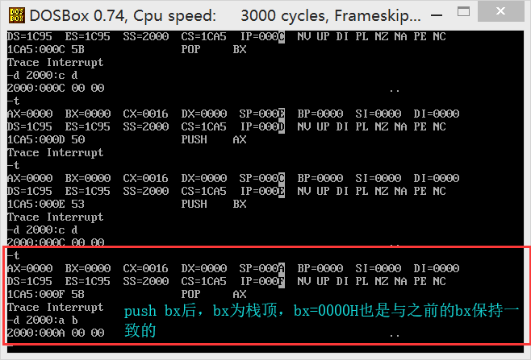

#### p94实验3

#### 实验3 编程、编译、连接、跟踪

（1）将下面的程序保存为t1.asm文件，将其生成可执行文件t1.exe。

```assembly
assume cs:codesg

codesg segment

	mov ax, 2000H
	mov ss, ax
	mov sp, 0
	add sp, 10
	pop ax
	pop bx
	push ax
	push bx
	pop ax
	pop bx
	
	mov ax, 4c00H
	int 21H

codesg ends

end
```

**答案**

第一题是很简单的，只需执行下面的两句：

```shell
masm tl.asm
link tl.obj
```

（2）用Debug跟踪t1.exe的执行过程，写出每一步执行后，相关寄存器中的内容和栈顶的内容。

**答案**

具体看下面的执行过程，可能是由于用dosbox的原因，ax 和bx值竟然巧合为一样的值了。也可以参考这篇文章[[汇编语言（王爽）实验三 编程、编译、连接、跟踪](https://www.cnblogs.com/tsembrace/p/3223419.html)]()





（3）PSP的头两个字节是CD 20,用Debug 加载t1.exe，查看PSP的内容。


