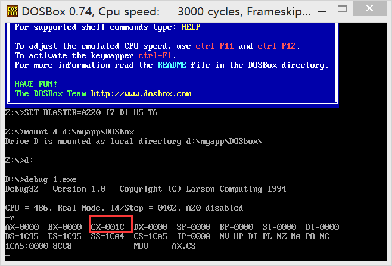
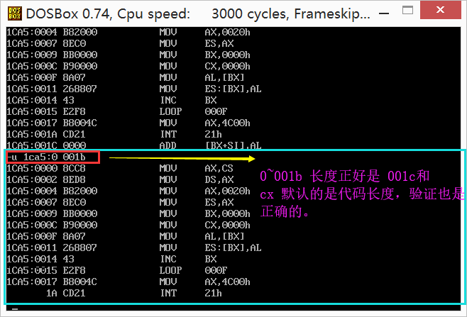
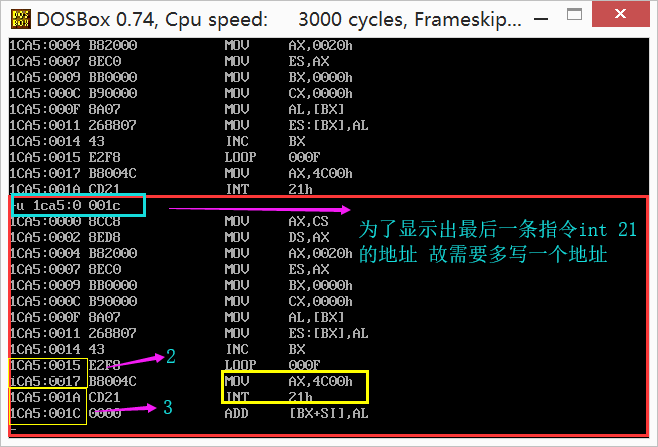
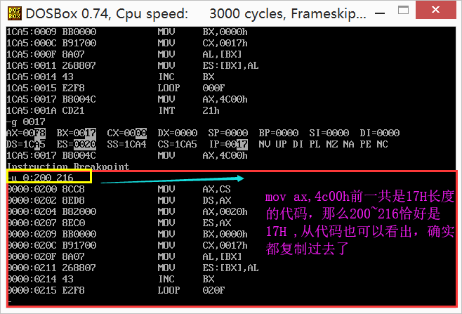

**实验4	[bx]和loop的使用**

（1）编程，向内存0:200~0:23F依次传送数据0~63（3FH）

**答案：**

```assembly
assume cs:code
code segment

    mov ax, 20h
    mov ds, ax

    mov bx, 0
    mov cx,40h
 s: mov [bx],bx

    int bx
    loop s

    mov ax, 4c00h
    int 21h
    
code ends
end

```

**解析：**

首先为了进行方便的操作，地址`0:200~0:23F`和地址`0020:0~0020:3F`指向的是同一个物理地址。且偏移地址都是从`0~3FH`。关于`mov cx, 40H`的理解，是因为0~3F 一共就是40H（3F+1）次。`mov [bx], bx`，其中的bx是偏移地址，这句代码的意思是偏移地址，但是这个题目巧的是偏移地址就是偏移地址单元中的值。还有一点，传送的是以**字**为单位的。这里其实是一种取巧的方式，传送字，接受字。故直接用的bx来接收数据。

> 注：题目中没有特别说明**单元的数据**时，可以选择单元或者字为单位，这里的题目就是用字单位传输数据的话，就方便一些。

（2）编程，向内存 0：200~0：23F依次传送数据0~63（3FH），程序中只能使用9条指令，9条指令中包含 “mov ax, 4c00h”和“int 21H”。

**答案：**

见题（1）

（3）下面的程序的功能是将“mov ax, 4c00h”之前的指令复制到内存 0：200处，补全程序。上机调试，跟踪运行结果。

```assembly
assume cs:code
code segment

    mov ax, ____
    mov ds, 0020h
    mov es, ax
    mov bx, 0
    mov cs, ____
s:  mov al,[bx]
    mov es:[bx], al
    
    inc bx
    loop s
    mov ax, 4c00h
    int 21h
code ends
end
```

提示：

（1）复制的是什么？从哪里到哪里？

（2）复制的是什么？有多少字节？你如何知道要复制的字节的数量？

**答案：**

```assembly

assume cs:code
code segment

    mov ax, cs
    mov ds, ax
    mov ax, 0020h
    mov es, ax
    mov bx, 0
    mov cx, 17h
s:  mov al, [bx]
    mov es:[bx], al
    
    inc bx
    loop s

    mov ax, 4c00h
    int 21h
code ends
end


```

**解析：**

由题目可得，复制的是程序代码，也就是代码段，故第一个空写`cs`。为了方便复制，我们把地址0：200改写成20：0，这样一来偏移地址就变成`0`了，我们通常用这样的方式，使题目变得简单。这样我们得知了要复制的是什么，以及从哪里（20：0）开始复制的问题。接下来就是复制的结尾是什么呢？因为我们知道`cx`默认的是程序段的大小的，故只要我们得知了cx的大小，然后减掉`mov ax, 4c00h ,int 21h`这两个程序语句所占的大小，就是我们要复制的程序的大小，这样一来我们要复制的程序的结束地址也便知道了。但是问题是我们不得知cx的长度，这样我们可以先给cx默认的值。比如0。这样我们的程序就变成了

```assembly
assume cs:code
code segment

    mov ax, cs
    mov ds, ax
    mov ax, 0020h
    mov es, ax
    mov bx, 0
    mov cx, 0
s:  mov al, [bx]
    mov es:[bx], al
    
    inc bx
    loop s

    mov ax, 4c00h
    int 21h
code ends
end


```

然后对程序进行debug:



从上面的图中我们可以看到程序**总长度** 是**001ch**。



验证正确。



通过上面的方式，我们用地址**相减**的方式可以得到最后两句的长度为**2+3 = 5**。也就是说，我们要进行**复制的代码的长度也就是 001C-5=0017h**。故我们要循环`0017h`次。也就是第二个空填的值。接下来我们验证一下我们的答案是不是正确。



正确！完工。