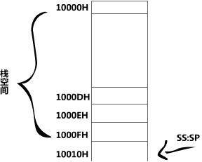

编程，将 10000H~1000FH这段空间当作栈，初始状态栈是空的，将 AX 、BX 、DS 中的数据入栈。

**答案**

```assembly
mov ax,1000H
mov ss,ax	;因为题目中已经说明，要用到“数据存储结构”栈，那么就要设置栈的段地址，			 SS = 1000H,不能直接向段寄存器SS中送入数据，所以用 ax 中转。
mov sp,0010H	;设置栈顶的偏移地址，因为栈为空，所以sp = 0010H，具体可以看下面			      的解析。
push ax
push bx
push ds
```

**解析**



以上就是数据结构图了。还有需要**注意**的一点就是，大家是否对于bx、ds 没有像ax一样进行中转就直接push到栈中。其实这是合理的，关于第一个 mov ss,ax 也只是为了折折ss 的值，ss 是(栈)段寄存器，ds(数据段寄存器)一样 只要是段寄存器 就不能直接赋值的。