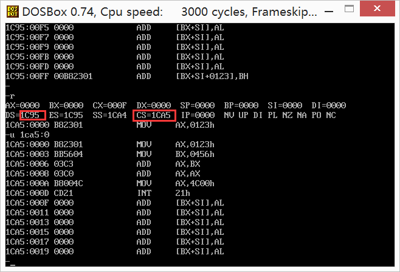

1.一个汇编程序`.exe`是由多个段组成的，而`.com`程序是由一个段组成的。

2.通用寄存器`CX`存放的是程序的长度，比如 cx = 000FH，那么程序中的机器码就有15个字节。

3.我们编写一个汇编程序 ，或许我们自己认为`DS`和`CS`的地址应该是保持一致的，因为我们只写了代码，其余的并未写入任何东西。但是，事实并非如此，这两个地址会相差`10H`，出现这个问题的原因是因为，在程序加载到内存之前，还有一段名为`PSP`（关于PSP以后再详细说明）的空间，正好是占10H,转化到物理地址就是100H 也就是256B(16进制100H = 1*16^2 + 0 * 16^1 + 0 * 16^0)。

故我们可以看到如下的结果：

1C95H + 10H = 1CA5H

